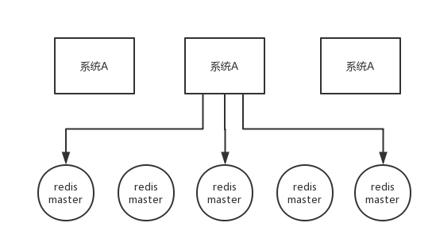

# 26-分布式锁设计

### 问题
一般实现分布式锁都有哪些方式？
使用 Redis 如何设计分布式锁？
使用 zk 来设计分布式锁可以吗？
这两种分布式锁的实现方式哪种效率比较高？

### 一、Redis 分布式锁
官方叫做 `RedLock` 算法，是 Redis 官方支持的分布式锁算法。

这个分布式锁有 3 个重要的考量点：
- 互斥（只能有一个客户端获取锁）
- 不能死锁
- 容错（只要大部分 Redis 节点创建了这把锁就可以）

#### 1.1、Redis 最普通的分布式锁
第一个最普通的实现方式，就是在 Redis 里使用 `SET key value [EX seconds] [PX milliseconds] NX` 创建一个 key，这样就算加锁。其中：
- `NX`：表示只有 `key` 不存在的时候才会设置成功，如果此时 redis 中存在这个 `key`，那么设置失败，返回 `nil`。
- `EX seconds`：设置 `key` 的过期时间，精确到秒级。意思是 `seconds` 秒后锁自动释放，别人创建的时候如果发现已经有了就不能加锁了。
- `PX milliseconds`：同样是设置 `key` 的过期时间，精确到毫秒级。

```
SET resource_name my_random_value PX 30000 NX
```
释放锁就是删除 key ，但是一般可以用 `lua` 脚本删除，判断 value 一样才删除：
```lua
-- 删除锁的时候，找到 key 对应的 value，跟自己传过去的 value 做比较，如果是一样的才删除。
if redis.call("get",KEYS[1]) == ARGV[1] then
    return redis.call("del",KEYS[1])
else
    return 0
end
```

为啥要用 `random_value` 随机值呢？因为如果某个客户端获取到了锁，但是阻塞了很长时间才执行完，比如说超过了 30s，此时可能已经自动释放锁了，此时可能别的客户端已经获取到了这个锁，要是你这个时候直接删除 key 的话会有问题，所以得用随机值加上面的 `lua` 脚本来释放锁。

但是这样是肯定不行的。因为如果是普通的 Redis 单实例，那就是单点故障。或者是 Redis 普通主从，那 Redis 主从异步复制，如果主节点挂了（key 就没有了），key 还没同步到从节点，此时从节点切换为主节点，别人就可以 set key，从而拿到锁。

#### 1.2、RedLock 算法
这个场景是假设有一个 Redis cluster，有 5 个 Redis master 实例。然后执行如下步骤获取一把锁：

1. 获取当前时间戳，单位是毫秒；
2. 跟上面类似，轮流尝试在每个 master 节点上创建锁，过期时间较短，一般就几十毫秒；
3. 尝试在**大多数节点**上建立一个锁，比如 5 个节点就要求是 3 个节点 `n / 2 + 1` ；
4. 客户端计算建立好锁的时间，如果建立锁的时间小于超时时间，就算建立成功了；
5. 要是锁建立失败了，那么就依次之前建立过的锁删除；
6. 只要别人建立了一把分布式锁，你就得**不断轮询去尝试获取锁**。



[Redis 官方](https://redis.io/)给出了以上两种基于 Redis 实现分布式锁的方法，详细说明可以查看：https://redis.io/topics/distlock 。


### 二、zk 分布式锁
zk 分布式锁，其实可以做的比较简单，就是某个节点尝试创建临时 znode，此时创建成功了就获取了这个锁；这个时候别的客户端来创建锁会失败，只能**注册个监听器**监听这个锁。释放锁就是删除这个 znode，一旦释放掉就会通知客户端，然后有一个等待着的客户端就可以再次重新加锁。

com.payn.lock.ZooKeeperDistributedLock  
com.payn.lock.ZooKeeperSession

### redis 分布式锁和 zk 分布式锁的对比
- redis 分布式锁，其实**需要自己不断去尝试获取锁**，比较消耗性能。
- zk 分布式锁，获取不到锁，注册个监听器即可，不需要不断主动尝试获取锁，性能开销较小。

另外一点就是，如果是 Redis 获取锁的那个客户端 出现 bug 挂了，那么只能等待超时时间之后才能释放锁；而 zk 的话，因为创建的是临时 znode，只要客户端挂了，znode 就没了，此时就自动释放锁。

Redis 分布式锁大家没发现好麻烦吗？遍历上锁，计算时间等等......zk 的分布式锁语义清晰实现简单。

所以先不分析太多的东西，就说这两点，我个人实践认为 zk 的分布式锁比 Redis 的分布式锁牢靠、而且模型简单易用。

