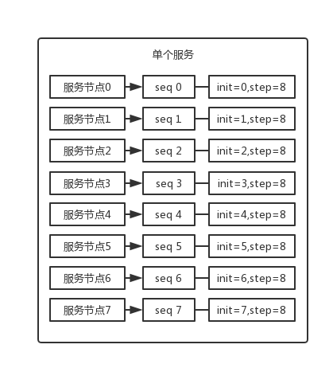

# 04-分库分表主键处理

### 问题
分库分表之后，id 主键如何处理？

id 如何生成？因为要是分成多个表之后，每个表都是从 1 开始累加，那肯定不对，需要一个**全局唯一**的 id 来支持。所以这都是实际生产环境中必须考虑的问题。

### 基于数据库的实现方案

#### 数据库自增 id
即系统里每次得到一个 id，都是往一个库的一个表里插入一条没什么业务含义的数据，然后获取一个数据库自增的一个 id。拿到这个 id 之后再往对应的分库分表里去写入。

这个方案的好处就是方便简单，谁都会用；**缺点就是单库生成**自增 id，要是高并发的话，就会有瓶颈的；如果你硬是要改进一下，那么就专门开一个服务出来，这个服务每次就拿到当前 id 最大值，然后自己递增几个 id，一次性返回一批 id，然后再把当前最大 id 值修改成递增几个 id 之后的一个值；但是**无论如何都是基于单个数据库**。

**适合的场景**：你分库分表就俩原因，要不就是单库并发太高，要不就是单库数据量太大；除非是你**并发不高，但是数据量太大**导致的分库分表扩容，你可以用这个方案，因为可能每秒最高并发最多就几百，那么就走单独的一个库和表生成自增主键即可。

#### 设置数据库 sequence 或者表自增字段步长
可以通过设置数据库 sequence 或者表的自增字段步长来进行水平伸缩。

比如说，现在有 8 个服务节点，每个服务节点使用一个 sequence 功能来产生 ID，每个 sequence 的起始 ID 不同，并且依次递增，步长都是 8。



**适合的场景**：在用户防止产生的 ID 重复时，这种方案实现起来比较简单，也能达到性能目标。但是服务节点固定，步长也固定，将来如果还要增加服务节点，就不好搞了。

### UUID
好处就是本地生成，不要基于数据库来了；不好之处就是，UUID 太长了、占用空间大，**作为主键性能太差**了；更重要的是，UUID 不具有有序性，会导致 B+ 树索引在写的时候有过多的随机写操作（连续的 ID 可以产生部分顺序写），还有，由于在写的时候不能产生有顺序的 append 操作，而需要进行 insert 操作，将会读取整个 B+ 树节点到内存，在插入这条记录后会将整个节点写回磁盘，这种操作在记录占用空间比较大的情况下，性能下降明显。

适合的场景：如果你是要随机生成个什么文件名、编号之类的，你可以用 UUID，但是作为主键是不能用 UUID 的。

```java
UUID.randomUUID().toString().replace("-", "") -> sfsdf23423rr234sfdaf
```

### 获取系统当前时间
这个就是获取当前时间即可，但是问题是，**并发很高的时候**，比如一秒并发几千，**会有重复的情况**，这个是肯定不合适的。基本就不用考虑了。

适合的场景：一般如果用这个方案，是将当前时间跟很多其他的业务字段拼接起来，作为一个 id，如果业务上你觉得可以接受，那么也是可以的。你可以将别的业务字段值跟当前时间拼接起来，组成一个全局唯一的编号。

### snowflake 算法
snowflake 算法是 twitter 开源的分布式 id 生成算法，采用 Scala 语言实现，是把一个 64 位的 long 型的 id，1 个 bit 是不用的，用其中的 41 bits 作为毫秒数，用 10 bits 作为工作机器 id，12 bits 作为序列号。

- 1 bit：不用，为啥呢？因为二进制里第一个 bit 为如果是 1，那么都是负数，但是我们生成的 id 都是正数，所以第一个 bit 统一都是 0。
- 41 bits：表示的是时间戳，单位是毫秒。41 bits 可以表示的数字多达 `2^41 - 1` ，也就是可以标识 `2^41 - 1` 个毫秒值，换算成年就是表示 69 年的时间。
- 10 bits：记录工作机器 id，代表的是这个服务最多可以部署在 2^10 台机器上，也就是 1024 台机器。但是 10 bits 里 5 个 bits 代表机房 id，5 个 bits 代表机器 id。意思就是最多代表 `2^5` 个机房（32 个机房），每个机房里可以代表 `2^5` 个机器（32 台机器）。
- 12 bits：这个是用来记录同一个毫秒内产生的不同 id，12 bits 可以代表的最大正整数是 `2^12 - 1 = 4096` ，也就是说可以用这个 12 bits 代表的数字来区分**同一个毫秒内**的 4096 个不同的 id。

```
0 | 0001100 10100010 10111110 10001001 01011100 00 | 10001 | 1 1001 | 0000 00000000
```

41 bit 是当前毫秒单位的一个时间戳；5 bit 是传递进来的一个**机房** id（但是最大只能是 32 以内），另外 5 bit 是你传递进来的**机器** id（但是最大只能是 32 以内），剩下的那个 12 bit 序列号，就是如果跟你上次生成 id 的时间还在一个毫秒内，那么会把顺序给你累加，最多在 4096 个序号以内。

所以可以利用这个工具类，搞一个服务，然后对每个机房的每个机器都初始化这么一个东西，刚开始这个机房的这个机器的序号就是 0。然后每次接收到一个请求，说这个机房的这个机器要生成一个 id，就找到对应的 Worker 生成。

利用这个 snowflake 算法，可以开发自己公司的服务，甚至对于机房 id 和机器 id，反正给你预留了 5 bit + 5 bit，换成别的有业务含义的东西也可以的。

这个 snowflake 算法相对来说还是比较靠谱的，所以真是搞分布式 id 生成，如果是高并发啥的，那么用这个应该性能比较好，一般每秒几万并发的场景，也足够用了。

